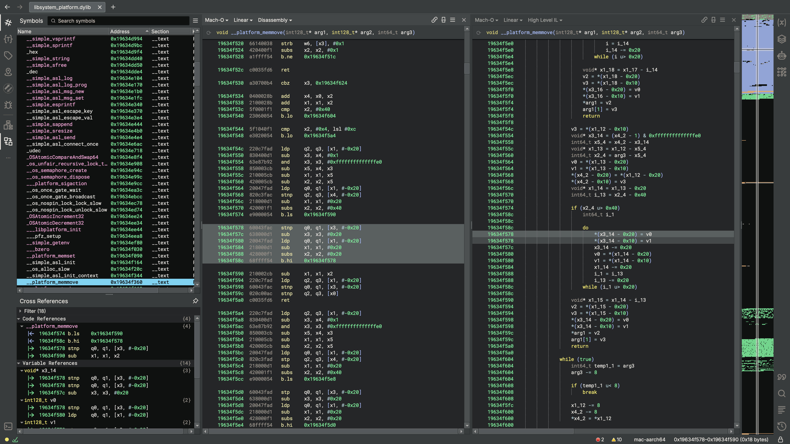
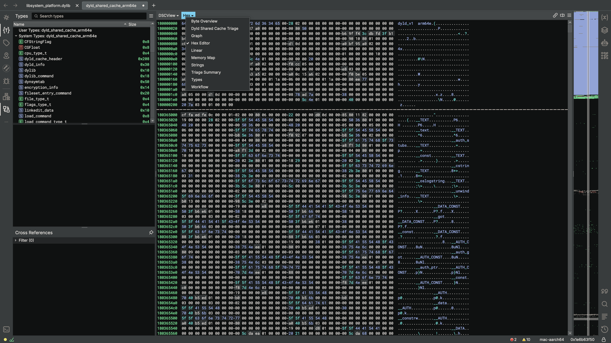
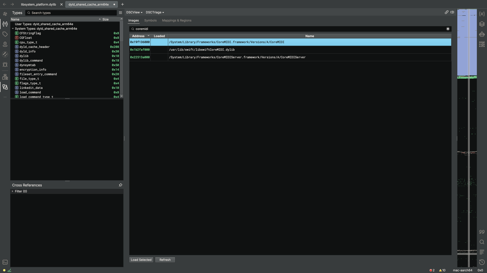
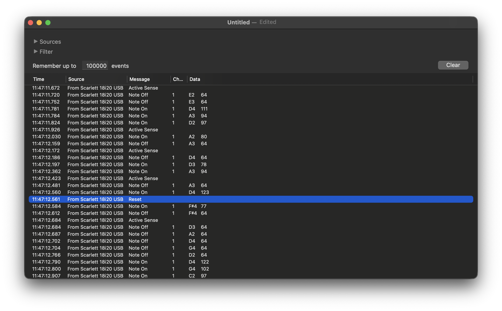
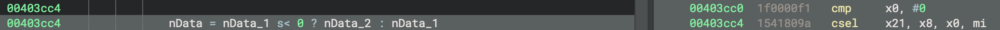

# Binary patching live audio software to fix a show-stopping bug

*December 6, 2025*

Outside of my day job of microcontroller firmware architecture and security, I also have a side hobby of playing keyboard instruments, mainly for churches. Recently, some friends invited me to play at a retreat for some local middle school youth groups, and I ended up down a weird rabbit hole of reverse-engineering our tracks software to fix a weird crash.

## My setup

Here's a photo of my setup for the weekend:


My laptop is doing all the heavy lifting here; everything else in this picture is just I/O connected to my computer. My keyboard and mixer send MIDI messages to [MainStage](https://www.apple.com/mainstage/), which actually creates the sounds. I'm also running click and tracks from my laptop via [Playback](https://www.multitracks.com/products/playback/) from the excellent [MultiTracks.com](https://www.multitracks.com). The click signal goes into our in-ear monitors to keep us in time and cue song sections and transitions, and the tracks are sent to the P.A. system to add a small amount of extra synths, percussion, and effects to the mix. I'm running my keys output and monitor mix through my audio interface, while click and tracks are sent to the sound board digitally via [Dante](https://en.wikipedia.org/wiki/Dante_(networking)).

## The problem

Everything worked great during setup and sound check, but as soon as we started our first set, a serious problem appeared: Playback began to crash frequently, usually every 30 seconds to 5 minutes. I spent half the set playing my keyboard with one hand and trying to relaunch Playback and seek to the right spot in the song with my other hand.


I have to give huge props to the rest of the band for holding it together with only intermittently-working click -- it's not *necessary* to play well, but it's nice to have and unexpectedly losing it live is jarring (especially after practicing with it).

At this point, all we had to troubleshoot was the circumstantial evidence that the crashes only occurred during our set -- not during rehearsal before, not after the set, and also not during the break between the first and second half of the set -- as well as a small clue from the crash log:

```
Thread 10 Crashed:
0   libsystem_platform.dylib      	       0x19634f578 _platform_memmove + 536
1   CoreMIDI                      	       0x1b4fc47c8 MIDIPacketListAdd + 292
2   ???                           	       0x16e70e60c ???
```

The application was apparently calling into macOS's MIDI processing library at the time of the crash, so maybe it was receiving a MIDI packet it didn't like.  We tried the obvious things like swapping out cables, as well as switching from Dante to a USB interface to "air-gap" my laptop from the stage network (in case the MIDI packet was coming from some other piece of equipment on the network, like perhaps a lighting controller). My laptop handles many thousands of MIDI messages during a set, so logging all of them to try to isolate the bad one didn't seem feasible (although in hindsight, I should have tried logging packets and then replaying portions of the log to binary-search for the bad packet).

But no luck, the crashes occurred again during the rehearsal before our second set. We decided to just practice without click and tracks for that set, and afterwards I sat down, opened up Binary Ninja, and took a closer look at the crash log to see if I could figure out what was going on.

## `_platform_memmove`

```
Process:             Playback [10097]
Path:                /Applications/Playback.app/Contents/MacOS/Playback
Identifier:          com.multitracks.custommixplayer
Version:             8.4.6 (84600)
Code Type:           ARM-64 (Native)
Role:                Foreground
Parent Process:      launchd [1]
Coalition:           com.multitracks.custommixplayer [2355]
User ID:             501

Date/Time:           2025-11-08 11:47:12.6320 -0800
Launch Time:         2025-11-08 11:44:48.8817 -0800
Hardware Model:      MacBookPro18,1
OS Version:          macOS 26.1 (25B78)
Release Type:        User

[...]

Triggered by Thread: 10

Exception Type:    EXC_BAD_ACCESS (SIGBUS)
Exception Subtype: KERN_PROTECTION_FAILURE at 0x000000016e68bfe0
Exception Message: Thread stack size exceeded
Exception Codes:   0x0000000000000002, 0x000000016e68bfe0

Termination Reason:  Namespace SIGNAL, Code 10, Bus error: 10
Terminating Process: exc handler [10097]


VM Region Info: 0x16e68bfe0 is in 0x16e688000-0x16e68c000;  bytes after start: 16352  bytes before end: 31
      REGION TYPE                    START - END         [ VSIZE] PRT/MAX SHRMOD  REGION DETAIL
      Stack                       16e600000-16e688000    [  544K] rw-/rwx SM=PRV  thread 9
--->  STACK GUARD                 16e688000-16e68c000    [   16K] ---/rwx SM=NUL  stack guard for thread 10
      Stack                       16e68c000-16e714000    [  544K] rw-/rwx SM=PRV  thread 10

[...]

Thread 10 Crashed:
0   libsystem_platform.dylib      	       0x19634f578 _platform_memmove + 536
1   CoreMIDI                      	       0x1b4fc47c8 MIDIPacketListAdd + 292
2   ???                           	       0x16e70e60c ???

[...]

Thread 10 crashed with ARM Thread State (64-bit):
    x0: 0x000000016e70e21e   x1: 0x000000016e68c3d8   x2: 0xfffffffffff7dda2   x3: 0x000000016e68c000
    x4: 0x000000016e70e21d   x5: 0x000000000000001d   x6: 0xffffffffbfc007ff   x7: 0xfffff0003ffff800
    x8: 0x000000016e70e214   x9: 0x0000000000000000  x10: 0x0000000000000000  x11: 0x0000000000000ba8
   x12: 0x000000000015c045  x13: 0xe45671c33da16828  x14: 0x00000001037ff658  x15: 0x0000000c657d8000
   x16: 0x000000019634f360  x17: 0x000000020430c158  x18: 0x0000000000000000  x19: 0x000000016e70e214
   x20: 0xffffffffffffffff  x21: 0xffffffffffffffff  x22: 0x000000016e70e608  x23: 0x0000000000000000
   x24: 0x000000016e70e616  x25: 0x000000010344e000  x26: 0x0000000000000000  x27: 0x000000010344e000
   x28: 0x0000000010ff0000   fp: 0x000000016e70e200   lr: 0x00000001b4fc47c8
    sp: 0x000000016e70e1f0   pc: 0x000000019634f578 cpsr: 0xa0001000
   far: 0x000000016e68bfe0  esr: 0x92000047 (Data Abort) byte write Translation fault

Binary Images:
       0x102268000 -        0x102c43fff com.multitracks.custommixplayer (8.4.6) <2e45c6f3-7289-31fc-b856-8ae704ba7cfe> /Applications/Playback.app/Contents/MacOS/Playback
       [...]
       0x19634c000 -        0x1963543bf libsystem_platform.dylib (*) <530fc11d-a495-375d-b2b9-81ae3e701781> /usr/lib/system/libsystem_platform.dylib
       0x1b4fa2000 -        0x1b506f25f com.apple.audio.midi.CoreMIDI (2.0) <a1c1b28f-b788-34a7-b4b7-f83480e1d373> /System/Library/Frameworks/CoreMIDI.framework/Versions/A/CoreMIDI
```

This gives us very little information to go on. It appears that thread 10 has written past the "beginning" of its stack, into the guard page (which is region of memory at the ends of the stack left deliberately unmapped to ensure a stack overrun is guaranteed to cause a fault). In doing so, it has corrupted the stack badly enough that the crash reporter was unable to produce a backtrace. It can tell us that the current function is `_platform_memmove` (from the program counter), and that the call site is `MIDIPacketListAdd` (from the link register), but the rest of the stack trace is just `???`.

But we also have 29 general-purpose registers we can look at for clues. Let's disassemble `_platform_memmove` and see if we can figure out how that function was using the registers; maybe then the register contents can tell us something. `libsystem_platform.dylib` is a Mach-O universal binary, so we need to make sure we select the right architecture (the crash log tells us this is `arm64e`). We'll also configure Binary Ninja with [the base address where this library was actually loaded in memory](https://en.wikipedia.org/wiki/Address_space_layout_randomization) (`0x19634c000` in this case), so that we don't have to manually translate addresses (as much):


Jumping to the program counter at the time of the crash, we see that it's in the middle of a loop in `memmove`:



```asm
19634f578  60043fac   stnp    q0, q1, [x3, #-0x20]
19634f57c  638000d1   sub     x3, x3, #0x20
19634f580  20047fad   ldp     q0, q1, [x1, #-0x20]
19634f584  218000d1   sub     x1, x1, #0x20
19634f588  428000f1   subs    x2, x2, #0x20
19634f58c  68ffff54   b.hi    0x19634f578
```

This loop is copying downwards (from higher memory addresses to lower memory addresses). Each iteration copies 32 bytes from the address in `x1` to the address in `x3`. `x2` is used as a loop counter; the loop exits once the counter decrements past zero.

*(Aside, if you're wondering why this loop assumes the size is a multiple of 32: It's common for optimized `memcpy`-like functions to have a fast path that copies large chunks of aligned data, and slow paths for handling unaligned or smaller quantities. Often, when called with a large size, these functions will use the slow paths to handle the unaligned portion at the beginning and end, while the fast path is used for the bulk of the copy.)*

Looking at the register state, `x1` (the source address) is `0x000000016e68c3d8`, and `x3` (the destination address) is `0x000000016e68c000`. That destination address is the beginning of the address range allocated to the stack, which checks out -- we're moving from higher addresses to lower addresses, and the instruction stores to the 32 bytes *before* `*x3`, so we've crashed right as we fell off the beginning of the stack.

Interestingly, the stack pointer is way over at `0x000000016e70e1f0`, which is a much higher memory address. The stack grows downwards from higher memory addresses on ARM, so that means that we haven't had a stack overflow due to recursive function calls or anything; rather we're writing to unallocated stack space way beyond the stack pointer. This is *always* indicative of a bug. Unallocated space beyond the [red zone](https://en.wikipedia.org/wiki/Red_zone_(computing)) is liable to be overwritten at any time by a signal handler, so it's never meaningful to write something here.

So why are we doing that? Just how many bytes has `memmove` been asked to copy? The current value of the loop counter in `x2` is 0xfffffffffff7dda2, which is very large for a `size_t`...but also sort of negative-looking with all those leading `f`'s. Maybe `memmove` was accidentally called with a negative size? If we subtract `0xfffffffffff7dda2` from the current destination address `0x000000016e68c000`, we get `0x16e70e25e`, which is not far off of our stack pointer. So that seems reasonable to assume for now.

## `MIDIPacketListAdd`

Let's try to disassemble `MIDIPacketListAdd` to see if there's a code path that could lead to calling `memmove` with a negative size. This is a part of macOS's [CoreMIDI](https://developer.apple.com/documentation/coremidi/) library, which the crash log tells us is at `/System/Library/Frameworks/CoreMIDI.framework/Versions/A/CoreMIDI`:

```sh
$ ls /System/Library/Frameworks/CoreMIDI.framework/Versions/A/CoreMIDI
ls: /System/Library/Frameworks/CoreMIDI.framework/Versions/A/CoreMIDI: No such file or directory
$ 
```

...huh?

Apple's dynamic linker (`dyld`) has a performance optimization known as the ["shared cache"](https://github.com/apple-oss-distributions/dyld/blob/main/doc/CacheLayout.md). Essentially, they pre-link all system libraries into one giant binary that can be memory-mapped into each process to improve executable load times. When a process attempts to `dlopen` a dynamic library at a path like `/System/Library/Frameworks/CoreMIDI.framework/Versions/A/CoreMIDI`, the dynamic linker first checks if that path is in the shared cache; if so, the library does not need to be separately loaded from disk. On older versions of macOS, the OS installer would rebuild the shared cache from the original dynamic libraries on disk after each system update; however, sometime within the past few years, Apple decided to save on disk space by distributing a prebuilt shared cache with OS releases and not shipping the original libraries at all. So, even though the library can be linked into a program, there's no binary for us to analyze!

Fortunately, Binary Ninja has the ability to extract libraries from the shared cache, although this functionality is quite well hidden. First, load up Binary Ninja and point it at the easy-to-remember path `/System/Volumes/Preboot/Cryptexes/OS/System/Library/dyld/dyld_shared_cache_arm64e`. Binary Ninja will then consume 12GB of memory and show you the shared cache as a hexdump. If you click on the "Hex" dropdown, a new option appears: Dyld Shared Cache Triage.



You can then search for the library you want, and select "Load Selected". Switch the editor to "Linear" view, and the symbols from the library you want will be loaded and decompiled.



Jumping to `MIDIPacketListAdd`, we can see that this function does indeed call `memmove`, always passing the `nData` argument as the number of bytes to copy.

```c
19f1586a4    struct MIDIPacket* _MIDIPacketListAdd(struct MIDIPacketList* pktlist, ByteCount listSize, struct MIDIPacket* curPacket, MIDITimeStamp time, ByteCount nData, Byte* data)

19f1586b8        struct MIDIPacket* result = curPacket
19f1586bc        void* x8 = pktlist + listSize
19f1586c0        uint32_t numPackets = pktlist->numPackets
19f1586c0        
19f1586c4        if (numPackets == 0)
19f1586c4            goto label_19f158724
19f1586c4        
19f1586d0        uint64_t length
19f1586d0        
19f1586d0        if (result->timeStamp != time)
19f15870c            length = zx.q(result->length)
19f158718        label_19f158718:
19f158718            result = &result->data[3 + length] & 0xfffffffffffffffc
19f158724        label_19f158724:
19f158724            
19f158728            if (&result->data[nData] u> x8)
19f15872c                return nullptr
19f15872c            
19f158734            length = 0
19f15873c            pktlist->numPackets = numPackets + 1
19f158740            result->timeStamp = time
19f158744            result->length = 0
19f1586d0        else
19f1586d8            length = zx.q(result->length)
19f1586d8            
19f1586f4            if (zx.d(result->data[length - 1]) == 0xf7 || zx.d(*data) == 0xf0)
19f1586e8                goto label_19f158718
19f1586e8            
19f158704            if (&result->data[length + nData] u> x8)
19f15872c                return nullptr
19f15872c        
19f15874c        void* x0 = &result->data[zx.q(length.d)]
19f15874c        
19f158754        if (nData s> 1)
19f15875c            if (nData == 2)
19f15875c                goto label_19f158780
19f15875c            
19f158764            if (nData == 3)
19f158764                goto label_19f158778
19f158764            
19f15876c            if (nData != 4)
19f1587c4                j___platform_memmove(x0, data, nData)
19f15876c            else
19f158770                uint8_t x8_3 = *data
19f158770                data = &data[1]
19f158774                *x0 = x8_3
19f158774                x0 += 1
19f158778            label_19f158778:
19f158778                uint8_t x8_4 = *data
19f158778                data = &data[1]
19f15877c                *x0 = x8_4
19f15877c                x0 += 1
19f158780            label_19f158780:
19f158784                *x0 = *data
19f15879c                *(x0 + 1) = data[1]
19f158754        else if (nData != 0)
19f158794            if (nData != 1)
19f1587c4                j___platform_memmove(x0, data, nData)
19f158794            else
19f15879c                *x0 = *data
19f15879c        
19f1587a8        result->length += nData.w
19f1587b8        return result
```

So, if we're correct in our guess that `memmove` was called with a negative size, we need to look at callers of `MIDIPacketListAdd`.

## `MIKMIDI`

The code for Playback is split into a number of dynamic libraries. Fortunately, since dynamically-linked symbols are referenced by name, we can easily find which libraries might be calling `MIDIPacketListAdd` with a simple `grep`:

```
> rg -uuu MIDIPacketListAdd
Contents/Frameworks/MIKMIDI.framework/Versions/A/MIKMIDI: binary file matches (found "\0" byte around offset 4)
> 
```

And indeed, loading that into binja and searching for symbol references, we do find two calls to that function:

![One reference in `+[MIKMIDICommand commandsWithMIDIPacket:]`, and another in `_MIKCreateMIDIPacketListFromCommands`](references.png "One reference in +[MIKMIDICommand commandsWithMIDIPacket:], and another in _MIKCreateMIDIPacketListFromCommands")

At this point I googled `MIKMIDI` to see if this library was open-source, and [indeed it is](https://github.com/mixedinkey-opensource/MIKMIDI). I figured maybe another user of this library could have encountered a similar crash before, so I searched the issue tracker for `MIDIPacketListAdd`, and found [a helpful comment](https://github.com/mixedinkey-opensource/MIKMIDI/issues/314#issuecomment-1120246223):

> A System Message (MIKMIDICommandTypeSystemMessage) results in standardLength being -1. You can reproduce the crash by sending a message with status byte 0xFF (Reset command) to the library. Some footswitches seem to be sending those messages, for example.

`standardLength` is a variable in the [`commandsWithMIDIPacket:`](https://github.com/mixedinkey-opensource/MIKMIDI/blob/9373633014db4bce94a5375c32df19e6c74311a9/Source/MIKMIDICommand.m#L55) method, which is passed as a parameter to `MIDIPacketListAdd`!

```objc
+ (NSArray *)commandsWithMIDIPacket:(MIDIPacket *)inputPacket
{
	NSMutableArray *result = [NSMutableArray array];
	NSInteger dataOffset = 0;
	while (dataOffset < inputPacket->length) {
		const Byte *packetData = inputPacket->data + dataOffset;
		MIKMIDICommandType commandType = (MIKMIDICommandType)packetData[0];
		NSInteger standardLength = MIKMIDIStandardLengthOfMessageForCommandType(commandType);
		if (commandType == MIKMIDICommandTypeSystemExclusive) {
			// For sysex, the packet can only contain a single MIDI message (as per documentation for MIDIPacket)
			standardLength = inputPacket->length;
		}
		if (dataOffset > (inputPacket->length - standardLength)) break;

		// This is gross, but it's the only way I can find to reliably create a
		// single-message MIDIPacket.
		MIDIPacketList packetList;
		MIDIPacket *midiPacket = MIDIPacketListInit(&packetList);
		midiPacket = MIDIPacketListAdd(&packetList,
										  sizeof(MIDIPacketList),
										  midiPacket,
										  inputPacket->timeStamp,
										  standardLength,
										  packetData);
        
		MIKMIDICommand *command = [MIKMIDICommand commandWithMIDIPacket:midiPacket];
		if (command) [result addObject:command];
		dataOffset += standardLength;
	}

	return result;
}
```

The value comes from [`MIKMIDIStandardLengthOfMessageForCommandType`](https://github.com/mixedinkey-opensource/MIKMIDI/blob/9373633014db4bce94a5375c32df19e6c74311a9/Source/MIKMIDIUtilities.m#L112):

```objc
// Result includes status/command type byte
switch (commandType) {
    case MIKMIDICommandTypeNoteOff:
    case MIKMIDICommandTypeNoteOn:
    case MIKMIDICommandTypePolyphonicKeyPressure:
    case MIKMIDICommandTypeControlChange:
    case MIKMIDICommandTypePitchWheelChange:
    case MIKMIDICommandTypeSystemSongPositionPointer:
        return 3;
        break;
    case MIKMIDICommandTypeProgramChange:
    case MIKMIDICommandTypeChannelPressure:
    case MIKMIDICommandTypeSystemTimecodeQuarterFrame:
    case MIKMIDICommandTypeSystemSongSelect:
        return 2;
        break;
    case MIKMIDICommandTypeSystemTuneRequest:
    case MIKMIDICommandTypeSystemTimingClock:
    case MIKMIDICommandTypeSystemStartSequence:
    case MIKMIDICommandTypeSystemContinueSequence:
    case MIKMIDICommandTypeSystemStopSequence:
    case MIKMIDICommandTypeSystemKeepAlive:
        return 1;
        break;
    case MIKMIDICommandTypeSystemMessage:
    case MIKMIDICommandTypeSystemExclusive:
        return -1; // No standard length
        break;
    default:
        return NSIntegerMin;
        break;
}
```

This function calculates the length of a MIDI message given the command byte, and returns a negative value if the packet is variable-length length or is invalid. The caller handled one case where this could happen (a SysEx message), but not the other cases. In the event of a system message (with command byte 0xff), `MIKMIDIStandardLengthOfMessageForCommandType` would return -1, and `commandsWithMIDIPacket:` would pass this value on to `MIDIPacketListAdd`, where it would get used as the size parameter to `memmove`, causing the exact crash we saw. It seems our guess was correct!

To confirm, I enabled macOS's [inter-application MIDI bus](https://support.apple.com/guide/audio-midi-setup/transfer-midi-information-between-apps-ams1013/mac) and used the [`sendmidi`](https://github.com/gbevin/SendMIDI) command-line tool to send Playback a MIDI system reset message:

```
$ sendmidi dev 'IAC Driver Bus 1' rst
```

Playback immediately crashed, with the exact same stack trace!

I then used [a MIDI logger](https://www.snoize.com/MIDIMonitor/) to record a trace of me playing my keyboard for a while. Eventually Playback crashed again, and I searched the log, finding that my audio interface had indeed received a MIDI reset message corresponding to the time of the crash:



Finally I know for sure the exact message that was causing the crash, and can reproduce it on demand.

## Fixing the bug

Now that I knew the cause of the crash, and could reproduce it, I needed to stop it from happening. Clearly something funky is going on with my hardware to cause the reset message, but Playback clearly has a bug if it cannot handle that message gracefully. I knew I'd eventually need to track down the underlying hardware problem, but I had another set coming up, and it's easier to just patch the software than to spend more hours troubleshooting.

Here's the decompilation of `commandsWithMIDIPacket:`


The highlighted `csel` is the following branch from the source code, which handles system-exclusive messages (one of the causes of a negative `standardLength`):

```objc
if (commandType == MIKMIDICommandTypeSystemExclusive) {
    // For sysex, the packet can only contain a single MIDI message (as per documentation for MIDIPacket)
    standardLength = inputPacket->length;
}
```

In order to quickly address the bug, I decided to change the branch condition to `if (standardLength < 0)`, by replacing those two instructions:



This is almost certainly an incorrect "fix" for the bug -- in fact, looking more closely at the code in retrospect, it probably drops some messages if the system reset message is not at the end of the packet (as well as introducing an out-of-bounds read if it's not at the beginning). But it doesn't crash, and in order to just get through the rest of the weekend, I didn't mind the occasional dropped message (since Playback is only listening for a couple of MIDI messages, and none of them are mission-critical).

From there I just had to export the patched binary and codesign it:

```
$ sudo codesign -s - -f Frameworks/MIKMIDI.framework/Versions/A/MIKMIDI
```

And indeed, the fix worked! Playback was stable the rest of the weekend; no more crashes.

## Aftermath

After I got home, I emailed the MultiTracks.com support team with a description of the problem and my troubleshooting steps. The next morning I woke up to this in my inbox:

> We are a little slammed this week, but I wanted to take a minute and thank you for this, Jonathan!
> We have had two isolated reports of certain connected MIDI device crashing Playback, and couldn't see this MIDI message in MIDI monitoring apps, and also couldn't track this down for the last 4 weeks.
> Your effort here is SO appreciated by our developers and team. So thank you!
> 
> I do apologize you were impacted by this crash, and we will do our best to investigate with your steps, and get a resolution here!
> I've added 15 credits to your MultiTracks.com, both as an apology for the headache of the crash, and secondly as a big thank you from our team to yours! 🙂

I received a follow-up from them letting me know that they'd fixed the issue internally and offering to send me a beta build if I needed it right away. They said their fix is a larger code change which they are holding off on rolling out to avoid introducing new bugs until after Christmas (which is a very busy time for church music and production teams). Perhaps they decided to fully replace MIKMIDI with something better-maintained?

I also spent some time doing the actual hardware troubleshooting to figure out why I was getting nonsensical MIDI messages. I wrote a little stress-tester to send MIDI messages over a loopback cable and verify the received data was correct, and with that I was able to pin down the issue to the MIDI input port on my audio interface, which was occasionally corrupting data. I stuck a toothpick into the data pins on the MIDI jack and wiggled it around a bit to scrape off any oxidation or straighten out a bent pin, and that fixed the corruption completely.
